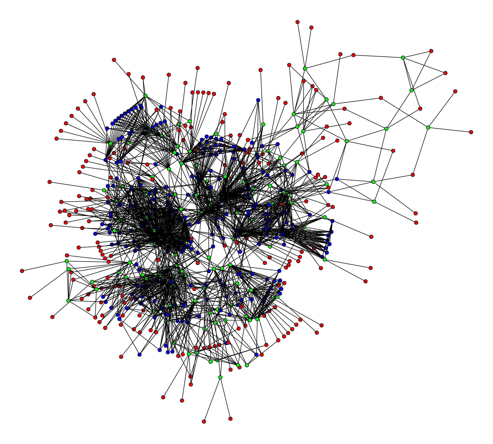
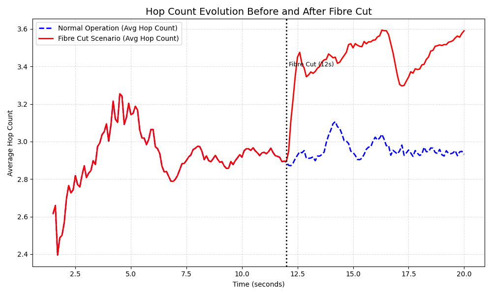
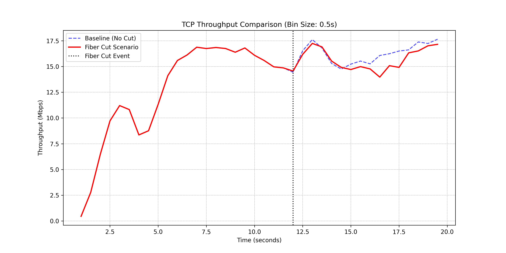
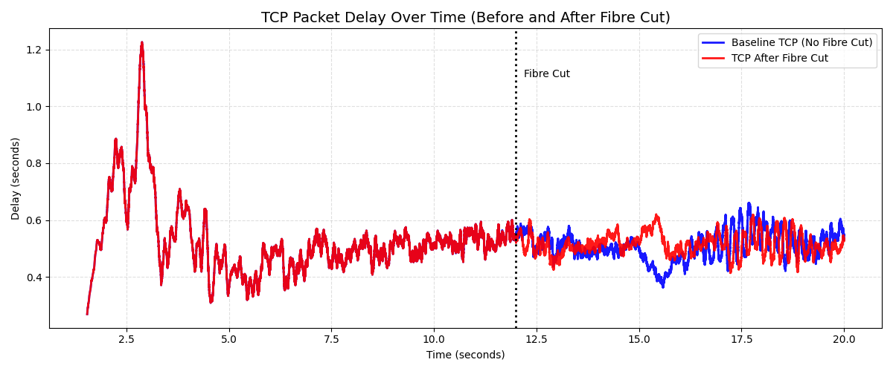
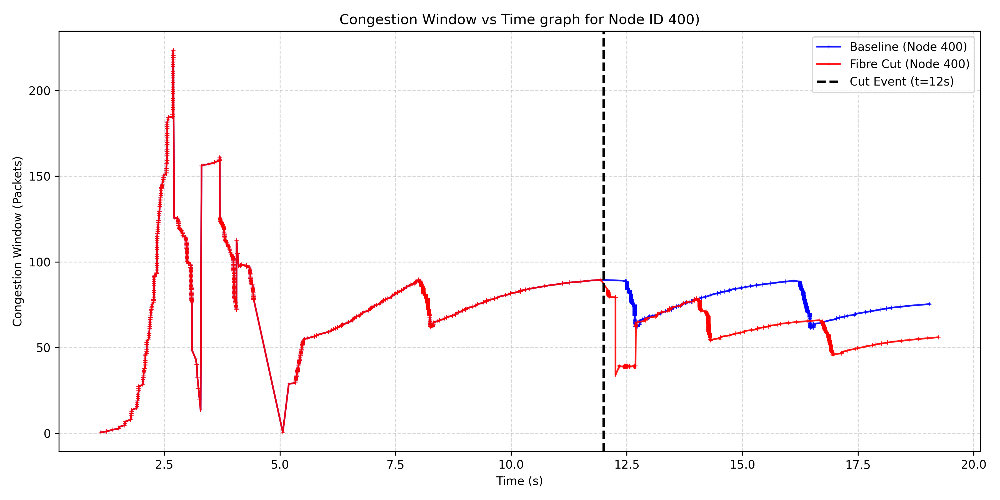

# Impact Analysis of Link Failure on TCP Performance Using Rocketfuel Topologies

Here I simulated a **fiber-cut scenario** to analyze the behavior of TCP with CUBIC congestion control. The experiment used a realistic Rocketfuel network topology. Leaf nodes acted as consumers (requesters), and a high-degree backbone router was selected as the content producer.

 <!-- placeholder for the Image of the topology -->

The simulation ran for 20 seconds. The first 12 seconds represented normal network operation. At **t = 12.0 s**, I introduced a failure by disabling the interface that connects the producer to its gateway routers. This effectively severed the primary link. A global routing recalculation was triggered **10 ms later (t = 12.01 s)** so the network could converge on the new paths.

---

## **Analysis of Results**

The effect of the link failure and the subsequent rerouting appears clearly in three metrics: Hop Count, Throughput, and Average Delay, Congestion Window (CWND).

---

## **1. Path Stretch (Hop Count Analysis)**

The Hop Count graph gives direct evidence of the rerouting event.

- **Before the cut (t < 12s):** Traffic followed a stable, optimal route of around **3 hops**.
- **After the cut (t > 12s):** Right after the failure and routing update, the hop count increased and stabilized at about **4 hops**.

This shows that the network successfully switched to a backup path. The increase from 3 to 4 hops indicates a **path stretch**—the new route is a detour that forces packets to travel through additional routers to reach the producer.

 <!-- placeholder for Hop count graph. hop-count.png -->

---

## **2. Throughput Degradation**

The throughput results align with the increase in path length.

- Before the cut, the red line (cut scenario) matches the blue baseline.
- At **t = 12s**, throughput drops sharply.
- After rerouting, the throughput does not return to its previous level.

This behavior is expected for TCP. Throughput is inversely related to Round Trip Time (RTT). A longer backup path increases the RTT, which limits how fast TCP can grow its congestion window and deliver data.

 <!-- placeholder for Throughput graph, throughput.png -->

---

## **3. Increased Delay**

The delay results follow the same trend.

- The initial spike from **1.5s to 4s** is caused by the **greedy consumer application**, which continuously sends data and quickly fills network buffers during TCP CUBIC’s slow-start phase.
- From **t = 4s to t = 12s**, the delay drops from its peak (greater than 1.2s) and settles into an average range of **0.4s to 0.6s**. This period corresponds to TCP CUBIC’s **Congestion Avoidance** phase, where the protocol stabilizes and operates around an equilibrium point.
- At **t = 12s**, the fiber cut occurs, and the routing updates take effect immediately. The red line permanently diverges from the baseline. This upward shift in delay confirms that traffic was rerouted to a longer backup path, adding extra latency due to the increased hop count.

 <!-- placeholder for delay graph, delay.png -->

## **4. Congestion Window**

## The graph demonstrates TCP CUBIC's distinct "concave-then-convex" window growth. It can clearly be seen from the graph: it increases rapidly at first (convex), flattens out as it approaches the bandwidth limit (concave) to safely probe for capacity, and then accelerates again if no loss occurs. As expected, following the link cut event at **t=12s**, the congestion window sharply decreases to adapt to the network disruption.



## **Usage**

### **Installation**

1. Install ndnSIM: https://ndnsim.net/current/
2. Clone this repository into your `ns-3/scratch` directory.

---

## **Compilation**

Run the simulation:

```bash
./waf --run TCP-Fibre-Cut
```

Or, run it and save all logs to a file:

```bash
./waf --run TCP-Fibre-Cut > scratch/TCP-Fibre-Cut/output.log 2>&1
```
